# 几种在腾讯云建立WordPress的方法（Linux）

——Ver 1.0 By ZNing at *CISE of SDUST* 

(Contact me: [Website](http://www.zning.net.cn)、[GitHub](https://github.com/zning1994)、[FaceBook](https://www.facebook.com/zning1994)、[Email](mailto:zning@sdust.edu.cn)、[Mobile](tel:+8613687671402))

> 引言：腾讯云作为国内一流的云服务提供商，云服务器CVM的使用可谓是“一键成站”，十分方便。今天我们就来介绍一下几种在腾讯云建立WordPress的方法。
> 
> 这里，我们仅介绍Linux下安装WordPress等内容托管开源程序的示例，对于在Windows下的环境配置与开源程序安装大同小异，只不过Windows下图形界面多一些使得让人看上去没那么难而已。

> 使用此教程前先修知识：[Linux简单命令](https://www.zning.net.cn/tech/3390.htm)、[Vim编辑器的使用](https://www.zning.net.cn/my/3392.htm)（点击链接即可查看相关教程）

**本文索引目录**

<link rel="stylesheet" href="http://yandex.st/highlightjs/6.2/styles/googlecode.min.css">
 
<script src="http://code.jquery.com/jquery-1.7.2.min.js"></script>
<script src="http://yandex.st/highlightjs/6.2/highlight.min.js"></script>
 
<script>hljs.initHighlightingOnLoad();</script>
<script type="text/javascript">
 $(document).ready(function(){
      $("h2,h3,h4,h5,h6").each(function(i,item){
        var tag = $(item).get(0).localName;
        $(item).attr("id","wow"+i);
        $("#category").append('<a class="new'+tag+'" href="#wow'+i+'">'+$(this).text()+'</a></br>');
        $(".newh2").css("margin-left",0);
        $(".newh3").css("margin-left",20);
        $(".newh4").css("margin-left",40);
        $(".newh5").css("margin-left",60);
        $(".newh6").css("margin-left",80);
      });
 });
</script>
<div id="category"></div>

## 【常规安装——LAMP或LNMP安装】

### 前奏：环境检查

1. 操作系统：Linux（本例使用的大部分在CentOS 7.x x64与Ubuntu 14.04.1 LTS 64位上可行）
2. 服务架构：LAMP或LNMP
> 注：此处LAMP为Linux+Apache+**MariaDB**+PHP，LNMP为Linux+Nginx+MySQL+PHP

3. 软体版本：Apache 2.4、MariaDB5.5、PHP5

###LAMP在CentOS上的配置

> 这一节是按照已有域名来写的，如果暂时没有域名或者只是想配置单网站，可以先看下一节“LNMP在CentOS上的配置”

Apache HTTP Server（简称Apache）是Apache软件基金会的一个开放源码的网页服务器，是最流行的Web服务器端软件之一。Apache 2.4版本是Apache一重大升级版本，新版改进了缓存、代理模块，会话控制，改进异步读写、增加proxy_fcgi各方面支持等，有大幅度提升并发性能。

下面，我们就介绍一下在Apache配置多域名或已有域名模式的WordPress，以供参考。

**更新系统**

	# yum update

####安装并配置 Apache 网络服务器

CentOS 7 中默认的是 Apache 2.4 版本，Apache 官网有份很好的 [vhost.conf 配置实例](http://httpd.apache.org/docs/current/vhosts/examples.html)。

**安装**

	# yum install -y httpd

**备份配置文件**（建议对于所有的配置文件，做任何更改前都先备份一份，以便应对未知错误）

	# mkdir ~/zningfbak
	# cp -R /etc/httpd ~/zningbak

其中 `～` 表示当前登录用户的用户文件夹；`-R` 参数表示递归到所有子目录

配置虚拟主机（/etc/httpd/conf.d/vhost.conf ）

	# vim /etc/httpd/conf.d/vhost.conf

文件内需要填写的内容：

	#
	# 主机 1
	# zning.net
	#
	<VirtualHost *:80>
		ServerAdmin admin@zning.net
		ServerName zning.net
		ServerAlias www
		# 注意下面这行末尾不要带 /
		DocumentRoot /srv/www/zning.net/html

	<Directory "/srv/www/zning.net/html/">
    	Options FollowSymLinks
    	# 下一行这样设置就可以在网站文件的目录中使用 .htaccess
    	AllowOverride All
    	# 下一行是替代 Allow from all 的新机制
    	Require all granted
	</Directory>

		ErrorLog /srv/www/zning.net/logs/error.log
		CustomLog /srv/www/zning.net/logs/access.log combined
		ServerSignature Off
	</VirtualHost>

	#
	# 主机 2
	# qcloud.zning.net
	# 这是另一个位于同一服务器的网站，如果不需要则删除此段配置
	#
	<VirtualHost *:80>
		ServerAdmin admin@zning.net
		ServerName test.zning.net
		ServerAlias test
		DocumentRoot /srv/www/qcloud.zning.net/html

	<Directory "/srv/www/qcloud.zning.net/html/">
    	Options FollowSymLinks
    	AllowOverride All
    	Require all granted
	</Directory>

		ErrorLog /srv/www/qcloud.zning.net/logs/error.log
		CustomLog /srv/www/qcloud.zning.net/logs/access.log combined
		ServerSignature Off
	</VirtualHost>

	#
	# 主机 3
	# 为了以后给访问 phpMyAdmin 的时候用，也可以是别的端口，如 4444
	Listen 3366
	#
	# phpMyAdmin，访问地址：http://12.34.56.78:3366/phpMyAdmin
	#
	<VirtualHost 12.34.56.78:3366>
		ServerAdmin admin@zning.net
		DocumentRoot /srv/www/phpmyadmin/html
	<Directory "/srv/www/phpmyadmin/html/">
	    Options FollowSymLinks
	    AllowOverride None
	    Require all granted
	</Directory>
		ErrorLog /srv/www/phpmyadmin/logs/error.log
		CustomLog /srv/www/phpmyadmin/logs/access.log combined
		ServerSignature Off
	</VirtualHost>

虽然配置文件写好了，但是还不能启动 httpd 进程，因为上面设置的各个文件夹（网站目录）还没有创建。

创建各个虚拟主机的文件夹（根据需要增加或删除），

	# 主机 1 的
	# mkdir /srv/www/zning.net/html -p
	# mkdir /srv/www/zning.net/logs

	# 主机 2 的
	# mkdir /srv/www/qcloud.zning.net/html -p
	# mkdir /srv/www/qcloud.zning.net/logs

	# 主机 3 的
	# mkdir /srv/www/phpmyadmin/html -p
	# mkdir /srv/www/phpmyadmin/logs

为了能够在系统启动时自动运行 Apache 服务器，需要运行下面的指令：

	# systemctl enable httpd

输出类似于，

	# Created symlink from /etc/systemd/system/multi-user.target.wants/httpd.service to /usr/lib/systemd/system/httpd.service.

然后启动 Apache 服务，

	# systemctl start httpd

如果上述指令提示说本来已经启动了 httpd，则重新加载它，

	# systemctl reload httpd

现在需要将 http 服务加入防火墙以允许外部访问。先启用防火墙服务，如果防火墙默认没有启动，则下述指令会提示错误，“FirewallD is not running”。

	# systemctl enable firewalld && systemctl start firewalld

其中 `&&` 表示两条指令依次执行。

启动后再重新执行下面的指令：

将 HTTP 默认使用的端口 80 加入到防火墙允许列表里

	# firewall-cmd --add-service=http --permanent

其中，`–permanent` 参数表示这是一条永久防火墙规则，如果不加这个参数则重启系统后就没有这条规则了。

而对于自定义的用于 phpMyAdmin 的 3366 端口，也需要添加相应的防火墙规则。因为是非标准端口，直接用数字表示即可，

	# firewall-cmd --zone=public --add-port=3366/tcp --permanent

重启 Firewalld 使该规则生效，

	# systemctl restart firewalld

如果要查看加入后的防火墙规则，使用指令，

	# firewall-cmd --list-all

显示结果类似于，

	public (default)
	  interfaces:
	  sources:
	  services: dhcpv6-client http ssh
	  ports: 3366/tcp
	  masquerade: no
	  forward-ports:
	  icmp-blocks:
	  rich rules:

如果已经做好了 DNS 域名解析，现在用浏览器打开域名应该能够看到 Apache 的测试页面了。

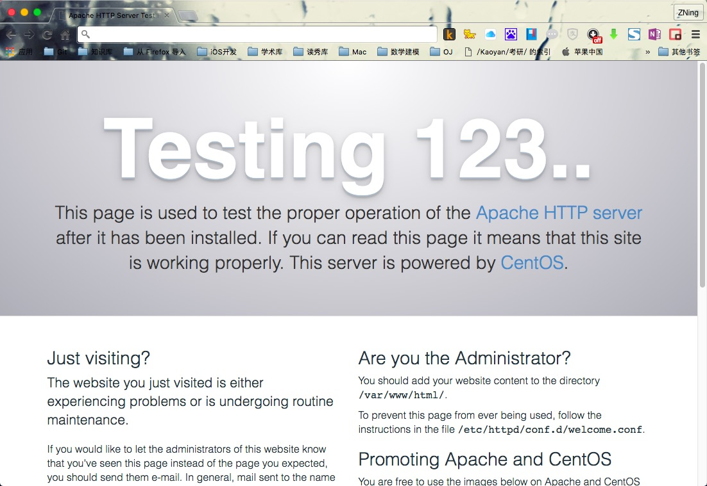

####安装和配置 MariaDB 数据库服务

MariaDB 是在 MySQL 基础上重建的一个数据库软件，各 Linux 发行版都陆陆续续从 MySQL 切换到了 MariaDB。CentOS 从 7 开始默认使用 MariaDB。

**安装**

	# yum install -y mariadb-server mariadb

**加入随系统启动**

	# systemctl enable mariadb

输出结果类似于，

	Created symlink from /etc/systemd/system/multi-user.target.wants/mariadb.service to /usr/lib/systemd/system/mariadb.service.

**启动 MariaDB 守护进程（mysqld）**

	# systemctl start mariadb

其默认用户名还是 mysql，

	# top -u mysql

可以查看内存占用情况。

**安全配置 MariaDB**

使用 MariaDB 内建的安全配置脚本进行配置

	# mysql_secure_installation
	
这里需要配置 mysql 根用户和密码、清除其他用户、清除不需要的数据库等。输出类似于下面的执行过程，其中需要我们从键盘输入的内容用**注释出来了：

```
NOTE: RUNNING ALL PARTS OF THIS SCRIPT IS RECOMMENDED FOR ALL MariaDB
      SERVERS IN PRODUCTION USE!  PLEASE READ EACH STEP CAREFULLY!

In order to log into MariaDB to secure it, we'll need the current
password for the root user.  If you've just installed MariaDB, and
you haven't set the root password yet, the password will be blank,
so you should just press enter here.

Enter current password for root (enter for none):
OK, successfully used password, moving on...

Setting the root password ensures that nobody can log into the MariaDB
root user without the proper authorisation.

Set root password? [Y/n] y **此处输入y**
New password:***这里输入你的密码（并不会显示）***
Re-enter new password:***再次输入***
Password updated successfully!
Reloading privilege tables..
 ... Success!


By default, a MariaDB installation has an anonymous user, allowing anyone
to log into MariaDB without having to have a user account created for
them.  This is intended only for testing, and to make the installation
go a bit smoother.  You should remove them before moving into a
production environment.

Remove anonymous users? [Y/n] y **此处输入y**
 ... Success!

Normally, root should only be allowed to connect from 'localhost'.  This
ensures that someone cannot guess at the root password from the network.

Disallow root login remotely? [Y/n] y **此处输入y**
 ... Success!

By default, MariaDB comes with a database named 'test' that anyone can
access.  This is also intended only for testing, and should be removed
before moving into a production environment.

Remove test database and access to it? [Y/n] y **此处输入y**
 - Dropping test database...
 ... Success!
 - Removing privileges on test database...
 ... Success!

Reloading the privilege tables will ensure that all changes made so far
will take effect immediately.

Reload privilege tables now? [Y/n] y **此处输入y**
 ... Success!

Cleaning up...

All done!  If you've completed all of the above steps, your MariaDB
installation should now be secure.

Thanks for using MariaDB! 
```


然后使用 MySQL 的 root 帐户（不同于 Linux 的 root 帐户，刚才设置密码了）登录进去

	# mysql -u root -p
	
输入密码后回车，下面是输出示例，可以看到命令提示符变为 MariaDB [(none)]>

```
Welcome to the MariaDB monitor.  Commands end with ; or \g.
Your MariaDB connection id is 20
Server version: 5.5.44-MariaDB MariaDB Server

Copyright (c) 2000, 2015, Oracle, MariaDB Corporation Ab and others.

Type 'help;' or '\h' for help. Type '\c' to clear the current input statement.

MariaDB [(none)]>
```

建一个新数据库给 WordPress 用（这里取名为 wpzning，也可以用别的名字）

	MariaDB [(none)]> create database wpzning;
创建一个新用户，并将该数据库的权限赋给他（这里只是举例，用户名为 zningwp_us，密码为 zningwp2016）

	MariaDB [(none)]> grant all on wpzning.* to 'zningwp_us' identified by 'zningwp2016';
更新权限

	MariaDB [(none)]> flush privileges;
退出数据库

	MariaDB [(none)]> quit
	
执行大体输出如下：

```
MariaDB [(none)]> create database wpzning;
Query OK, 1 row affected (0.00 sec)

MariaDB [(none)]> grant all on wpzning.* to 'zningwp_us' identified by 'zningwp2016';
Query OK, 0 rows affected (0.00 sec)

MariaDB [(none)]> flush privileges;
Query OK, 0 rows affected (0.00 sec)

MariaDB [(none)]> quit
Bye
```

	
备份配置文件，

	# cp /etc/my.cnf ~/zningbak/my.cnf.bak
其它的先不做了，回头用图形界面的 phpMyAdmin 来做。

####安装和配置 PHP

**安装 PHP5**

	# yum install -y php

备份配置文件 `/etc/php.ini`，还有 `php.conf` 以及 `10-php.conf`，

	# cp /etc/php.ini ~/zningbak/php.ini.bak
	# cp /etc/httpd/conf.d/php.conf ~/zningbak/httpd/conf.d/php.conf.bak
	# cp /etc/httpd/conf.modules.d/10-php.conf ~/zningbak/httpd/conf.modules.d/10-php.conf.bak

并确保 `/etc/php.ini` 中有下面的语句（不同的就修改，没有的就添加，某些数值可以后再调整，这是针对一个简单的运行 WordPress 的服务器的配置）：

	error_reporting = E_COMPILE_ERROR|E_RECOVERABLE_ERROR|E_ERROR|E_CORE_ERROR
	display_errors = Off
	log_errors = On
	max_execution_time = 300
	memory_limit = 32M

**安装 PHP-MYSQL**

为了在 PHP 中使用 MySQL，还需要安装这个 php-mysql 包：

	# yum install -y php-mysql

####安装和配置 phpMyAdmin （选作）

Remi 安装源上有最新的 PHP、MySQL 以及 phpMyAdmin 的 Yum 安装包，可以方便安装、更新。但是正在使用的 Linux 发行版 CentOS 7 上的软件包可能版本上要求不一样，所以使用 Yum 安装源优先级插件来进行控制。

安装使用 EPEL REPOSITORY
选择合适的源地址来安装，参考方法：安装使用 EPEL 安装源。

到 EPEL 主页：

[http://fedoraproject.org/wiki/EPEL#How_can_I_use_these_extra_packages.3F](http://fedoraproject.org/wiki/EPEL#How_can_I_use_these_extra_packages.3F)

找到 *The newest version of ‘epel-release’ for EL7*，点击打开新页面，复制 epel-release-latest-7.noarch.rpm 的链接（数字可能有变化，当前版本是 7）。采用下面的方法直接安装：

	# yum install -y https://dl.fedoraproject.org/pub/epel/epel-release-latest-7.noarch.rpm

**安装PHPMYADMIN**

	# yum install -y phpmyadmin

**配置**

phpMyAdmin 的默认安装目录是 `/usr/share/phpMyAdmin`，同时会在 Apache 的配置文件目录中自动创建虚拟主机配置文件 `/etc/httpd/conf.d/phpMyAdmin.conf` （区分大小写）。

同样的，先备份配置文件以防修改出现错误，

	# cp /etc/httpd/conf.d/phpMyAdmin.conf ~/zningbak/httpd/conf.d/phpMyAdmin.conf.bak

然后修改配置文件（`vim /etc/httpd/conf.d/phpMyAdmin.conf`）中有设置：

	Alias /phpMyAdmin /usr/share/phpMyAdmin
	Alias /phpmyadmin /usr/share/phpMyAdmin

也就是说，我们可以通过绑定到 Apache 服务器上的任何域名访问 phpMyDdmin。比如这里可以通过 zning.net/phpmyadmin 或者 zning.net/phpMyAdmin 访问。但是这样一来，phpMyAdmin 的内容就与网站内容混到一起了，感觉 phpMyAdmin 成了网站的一个目录。但实际上我们并不希望别人也去访问这个页面。所以我们使用习惯的地址加端口 3366（而不是默认的 80 端口，换成自己喜欢的端口就行，再比如 3344）的方式，即 IP:port/phpMyAdmin 的链接形式访问 phpMyAdmin，加 # 注释掉上面的 Apache Alias 规则:

	#Alias /phpMyAdmin /usr/share/phpMyAdmin
	#Alias /phpmyadmin /usr/share/phpMyAdmin

并将

	<Directory /usr/share/phpMyAdmin/>
	.........
	</Directory>
	
里面的

	Require ip 127.0.0.1
	Require ip ::1
改成

	Require all granted
	
保存退出，使之可以从任何地方都可以访问。如果本地电脑是固定 IP 的，为了安全，也可以将上面的 `Require all granted` 改成 `Require ip <your-local-ip>`。咱的 ADSL 就享受不到这样的待遇了。

因为在前面创建虚拟主机配置文件 `/etc/httpd/conf.d/vhost.conf` 的时候已经为 phpMyAdmin 配置了一个端口为 2082 的虚拟主机，只能通过该虚拟主机（端口）访问 phpMyAdmin。因为 `/srv/www/phpmyadmin/public_html` 配置为 phpMyAdmin 的虚拟主机目录，为该目录创建符号连接到 phpMyAdmin 安装目录（`/usr/share/phpMyAdmin`）：

	# ln -sf /usr/share/phpMyAdmin /srv/www/phpmyadmin/html
备份然后修改 phpMyAdmin 的配置文件，

	# cp /etc/phpMyAdmin/config.inc.php ~/zningbak/config.inc.php.bak

编辑文件：

	# vim /etc/phpMyAdmin/config.inc.php
找到其中的如下代码段：

	$cfg['blowfish_secret'] = '这里随便填上一串乱七八糟的字符即可，字母、数字等，长度最好大于 16 个';

按照上面的提示填写 `blowfish_secret` 字符串。其他的不用修改，保存并退出。

**重起 APACHE 使配置生效**

	# systemctl restart httpd

现在就可以通过 `ip:port/phpMyAdmin` （将 IP 换为你腾讯云服务器的 IP，端口为前面设置的 phpmyadmin 的虚拟主机端口，注意大小写）访问 phpMyAdmin 了。

使用前面创建的用户名和密码（2.3.4 中 grant 语句中包含的用户名和密码）登录 phpMyAdmin。

###安装WordPress

**域名配置**

首先配置域名DNS，这里以DNSPod为示例演示，截图中也有对相关记录的解释，接下来的其他方法也可通过此教程来配置域名解析。

DNSPod增加解析如图：

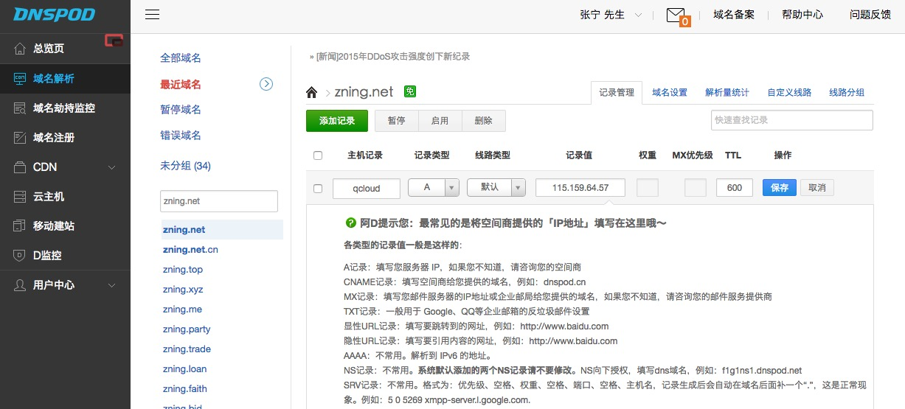

DNSPod解析详解如图：

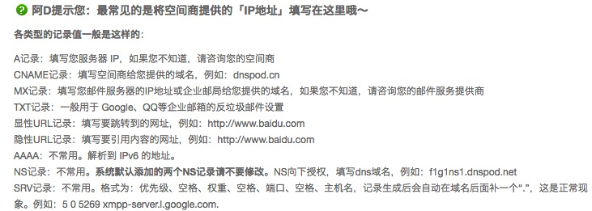

**安装**

转移目录到相关目录

	# cd /srv/www/qcloud.zning.net/html

下载WordPress

	# wget https://cn.wordpress.org/wordpress-4.5.2-zh_CN.tar.gz
	
解压文件

	# tar zxvf wordpress-4.5.2-zh_CN.tar.gz

移动文件

	# mv /srv/www/qcloud.zning.net/html/wordpress/* /srv/www/qcloud.zning.net/html
	
访问网址`qcloud.zning.net`，进行最后一步的安装。

出现如下图所示页面，单击继续：

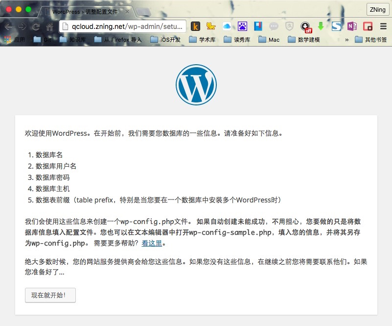

输入已经创建的数据库信息：

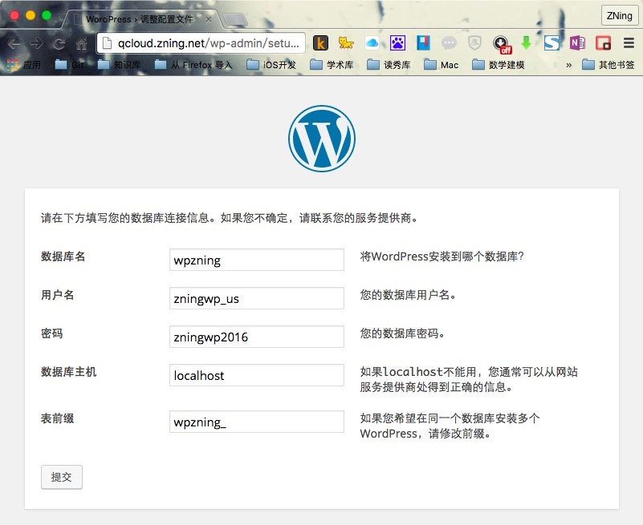

这一步出错的原因是，网站本身对html文件夹没有读写权限，具体解决方案可以查看本节参考资料链接中关于网站用户权限的讲解。此处我们可以按照提示，通过ssh，输入`vim /srv/www/qcloud.zning.net/html/wp-config.php`来创建，并复制WordPress已经提供的内容，保存继续即可

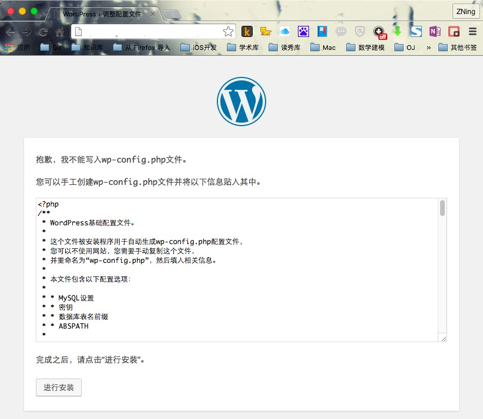

到这里说明已经连接了数据库，提供网站管理信息就可以继续安装咯。

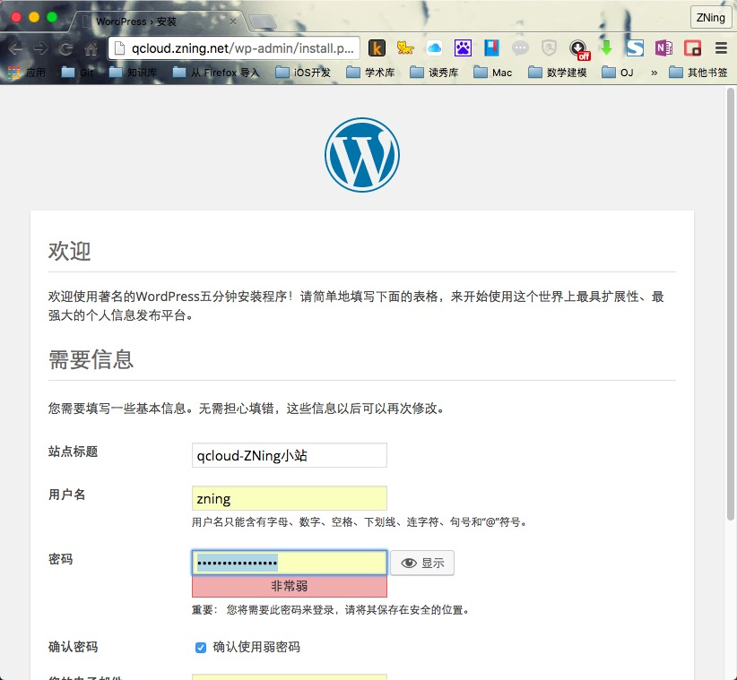

哇咔咔，这个页面不用解释了吧~

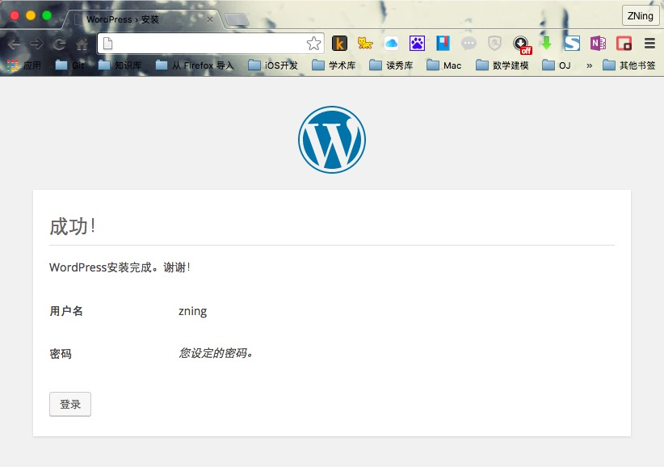

仪表盘控制后台界面：

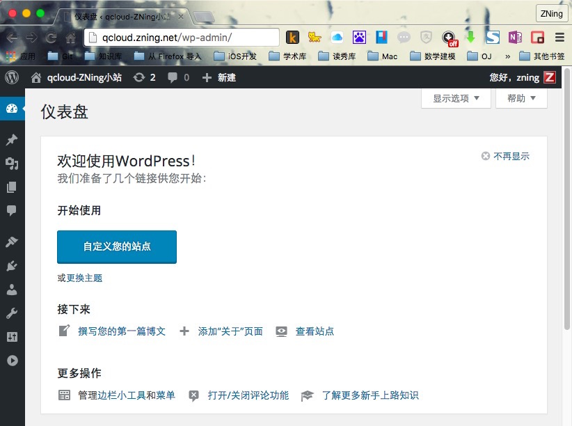

首页截图：

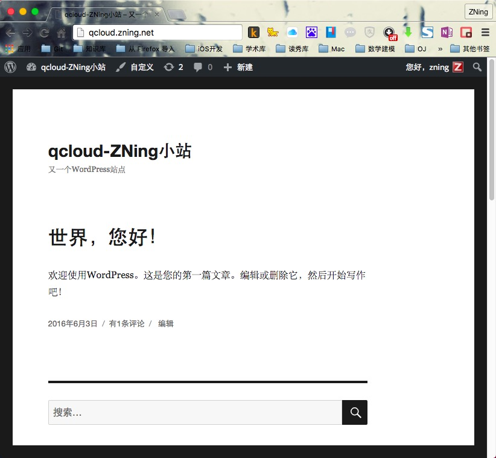

###LNMP在CentOS上的配置

Nginx是一款轻量级的Web 服务器，并在一个BSD-like 协议下发行。由俄罗斯的程序设计师Igor Sysoev所开发，供俄国大型的入口网站及搜索引擎Rambler使用。其特点是占有内存少，并发能力强。

下面，我们就介绍一下在Nginx配置单网站模式的WordPress，以供参考。

####安装Nginx服务程序

安装Nginx：

	# yum install -y nginx
	
使Nginx能够开机自启：

	# systemctl enable nginx
	
输出结果类似于，

	Created symlink from /etc/systemd/system/multi-user.target.wants/nginx.service to /usr/lib/systemd/system/nginx.service.
	
重新启动Nginx：

	# systemctl restart nginx.service

安装完成后，访问IP地址，出现如下图页面的欢迎界面，即说明已经完成安装了。

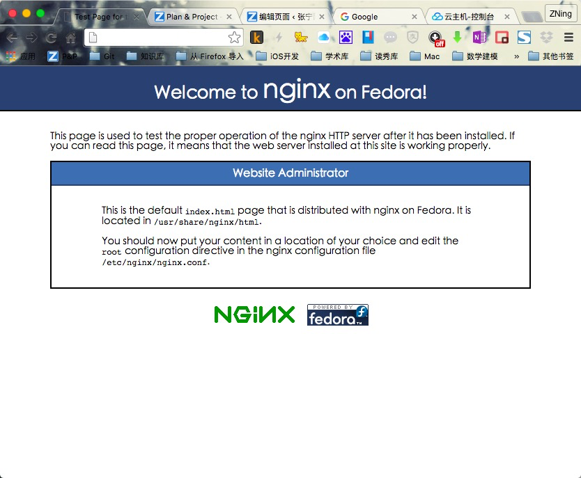

在这个页面我们看到

> This is the default index.html page that is distributed with nginx on Fedora. It is located in /usr/share/nginx/html.You should now put your content in a location of your choice and edit the root configuration directive in the nginx configuration file /etc/nginx/nginx.conf.

这两句话，这里告诉我们Nginx默认的配置文件在哪里，以及访问路径在哪里，也就是我们需要放置WordPress的路径在哪里。先记下来，等会有用

> 这里的Nginx是最简单的安装方法，其实最合适的安装方法还是在本地环境交叉编译完成后进行的安装，也不算特别麻烦，教程详见：[nginx服务器安装及配置文件详解](http://seanlook.com/2015/05/17/nginx-install-and-config/)

####安装 PHP 服务程序和 MariaDB 数据库服务程序

> 此步与上节相同，请参照上节相关子节的步骤进行即可。

不过按照上节步骤安装完PHP之后，需要安装一个php-fpm插件才行

	# yum install -y php-fpm
	
创建守护进程，并设置自启并启动：

	# systemctl enable php-fpm
	# systemctl start php-fpm
	
输出如下的类似内容：

	Created symlink from /etc/systemd/system/multi-user.target.wants/php-fpm.service to /usr/lib/systemd/system/php-fpm.service.
	
配置完成并启动后，我们通过如下命令可以看到进程的监听状态：

	# netstat -antl|grep 9000 
	# ps -ef|grep php-cgi
	
输出如下的类似内容：

	[root@QCLOUD share]# ps -ef|grep php-cgi
	root     12838  8024  0 10:23 pts/0    00:00:00 grep --color=auto php-cgi
	[root@QCLOUD share]# netstat -antl|grep 9000
	tcp        0      0 127.0.0.1:9000          0.0.0.0:*               LISTEN
	
####安装WordPress

首先配置`nginx.conf`，通过如下命令进入编辑器：

	# vim /etc/nginx/nginx.conf
	
在

```
        location / {
           index index.html index.php;
        }        
```
中添加

	index index.html index.php;
	
并在`}`后另起一行，添加如下内容：

```
         location ~ \.php$ {
            root           html;
            fastcgi_pass   127.0.0.1:9000;
            fastcgi_index  index.php;
            fastcgi_param  SCRIPT_FILENAME  $document_root$fastcgi_script_name;
            include        fastcgi_params;
        }
```

添加完成后，`server`代码区段的代码情况如下：

```
        location / {
           index index.html index.php;
        }

         location ~ \.php$ {
            root           html;
            fastcgi_pass   127.0.0.1:9000;
            fastcgi_index  index.php;
            fastcgi_param  SCRIPT_FILENAME  $document_root$fastcgi_script_name;
            include        fastcgi_params;
        }
```

然后，进入刚才所列的路径：

	# cd /usr/share/nginx/html
	
下载WordPress

	# wget https://cn.wordpress.org/wordpress-4.5.2-zh_CN.tar.gz
	
> 这里可能受服务器影响，北京机房下载速度不错，上海可能慢点。

解压文件

	# tar zxvf wordpress-4.5.2-zh_CN.tar.gz
	
更改与备份html文件夹现有文件：

	# mv index.html index.html.bak

移动文件

	# mv /usr/share/nginx/html/wordpress/* /usr/share/nginx/html
	
访问你服务器的IP地址，进行最后一步的安装。

> 安装情况同上节相关子节，请参见上一节的相关子节

###小结

这是最传统的安装方法，学习这样的安装方法主要还是为了熟悉Linux环境的命令操作与文本编辑。可以有效学习各种组件的调用执行原理。建议人人都会。

## 【懒人安装——集成环境安装(WDCP/AMH)】

### 还是前奏：环境检查

1. 操作系统：Linux（本例使用的大部分在CentOS 7.x x64与Ubuntu 14.04.1 LTS 64位上可行）
2. 服务架构：WDCP（提供LANMP）、AMH（提供LNMP）
> 注：此处LANMP为Linux+Apache+Nginx+MySQL+PHP
3. 软体版本：WDCP、AMH 4.2

### 在服务器上安装AMH并完成网站创建

Amysql Host 面板，简称AMH，是一个基于Nginx架构的类似 虚拟主机 独立面板。这个面板安装简单，非常适合Linux新手，以及一些恐惧命令行的Linux VPS用户。

AMH的主要功能有：在线划分虚拟主机（多个网站）、FTP帐号自定义、MYSQL在线创建和管理、数据备份（支持本地和异地备份）、任务计划（crontab自动任务）、以及模块扩展，可以通过AMH官方在面板的基础功能上扩展更多的功能。面板支持在线升级，减少工作量，更傻瓜化、简单化。

#### 安装AMH 4.2

> **注意：**AMH 4.2已经停止维护更新，所支持系统也仅限于如下几个：
> CentOS 6 x64、CentOS 6 i386、CentOS 5 x64、CentOS 5 i386、Ubuntu 12 x64、Ubuntu 12 i386、Debian 6 x64 (squeeze)、Debian 6 i386 (squeeze)
> 这里我们演示的时候，选择的是腾讯云CentOS 6.7 x64
> 新版本AHM 5.x支持至所有Linux的最新系统，但是已经成为了收费软体，因此这里不选择其进行安装。

根据[官方提示](http://amh.sh/install.htm)，我们按照如下操作进行安装：

1) 使用 root 账号登录 Linux 服务器。

2) 执行 amh 安装脚本。  

	wget http://amh.sh/file/AMH/4.2/amh.sh && chmod 775 amh.sh && ./amh.sh 2>&1 | tee amh.log

3) 根据提示输入选择1~3选项。1为安装amh，2为卸载amh，3为退出不做操作。

输入1回车，接着输入MySQL与AMH密码即进入安装流程，安装过程大约需10至20分钟(以服务器性能为准)，最后如看到安装成功提示，说明系统已安装完成。

成功安装后有必要请删除日志文件:amh.log，如安装失败需协助安装请把错误日志反馈我们。

访问http://ip:8888 即可进入AMH web端管理，默认账号为admin。

执行输出大体如下：

```
================================================================
 [LNMP/Nginx] Amysql Host - AMH 4.2
 http://Amysql.com
================================================================
CentOS release 6.7 (Final)
Server
64Bit, 1*CPU, 996MB*RAM, 2047MB*Swap
================================================================
[Notice] Confirm Install/Uninstall AMH? please select: (1~3)
1) Install AMH 4.2
2) Uninstall AMH 4.2
3) Exit
#? 1
[OK] You Selected: Install AMH 4.2
[Error] empty server ip.
[Notice] Please input server ip:127.0.0.1(此处需要填写自己的IP)
[OK] Your server ip is:
127.0.0.1
[Notice] Please input MySQL password:sdust（填写MySQL root密码，注意AMH脚本中输入密码为明文）
[OK] Your MySQL password is:
sdust
[Notice] Please input AMH password:sdust（填写AMH web面板密码，注意AMH脚本中输入密码为明文）
sdust


..........(各种安装软件的输出)


[OK] ams-1.5.0107-02 install completed.
=============================================================
 [LNMP/Nginx] Amysql Host - AMH 4.2
 http://Amysql.com

[OK] Nginx stop
=============================================================
 [LNMP/Nginx] Amysql Host - AMH 4.2
 http://Amysql.com

Shutting down MySQL. SUCCESS!
[OK] MySQL stop
=============================================================
 [LNMP/Nginx] Amysql Host - AMH 4.2
 http://Amysql.com

Starting MySQL. SUCCESS!
[OK] MySQL start
=============================================================
 [LNMP/Nginx] Amysql Host - AMH 4.2
 http://Amysql.com

[Notice] All PHP start...
正在启动 pure-config.pl：Running: /usr/local/sbin/pure-ftpd --daemonize -A -c50 -B -C8 -D -E -fftp -H -I15 -lpuredb:/etc/pureftpd.pdb -lunix -L10000:8 -m4 -s -U133:022 -u100 -k99 -Z -p10100:10110

=============================================================
 [LNMP/Nginx] Amysql Host - AMH 4.2
 http://Amysql.com

================================================================
[AMH] Congratulations, AMH 4.2 install completed.
AMH Management: http://115.159.64.57:8888
User:admin
Password:sdust
MySQL Password:sdust

******* SSH Management *******
Host: amh host
PHP: amh php
Nginx: amh nginx
MySQL: amh mysql
FTP: amh ftp
Backup: amh backup
Revert: amh revert
SetParam: amh SetParam
Module : amh module
Crontab : amh crontab
Upgrade : amh upgrade
Info: amh info

******* SSH Dirs *******
WebSite: /home/wwwroot
Nginx: /usr/local/nginx
PHP: /usr/local/php
MySQL: /usr/local/mysql
MySQL-Data: /usr/local/mysql/data

Start time: 2016年 06月 21日 星期二 11:30:42 CST
Completion time: 2016年 06月 21日 星期二 11:44:18 CST (Use: 13 minute)
More help please visit:http://amysql.com
================================================================
```
接着，我们访问http://ip:8888，进入AMH web端管理，进行操作。

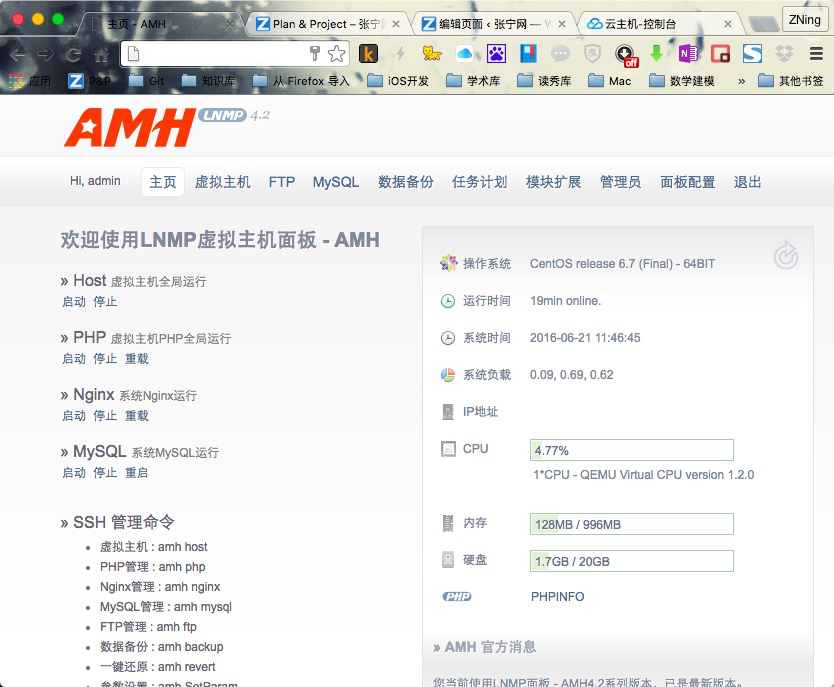

#### 在AMH web端配置网站访问

**配置虚拟主机**

这里，我们就需要一个域名了。接下来我继续以`qcloud.zning.net`这个二级子域名来演示。

进入后，单击`虚拟主机`下的`虚拟主机`标签，在下方的`新增虚拟主机`表单处的`主标识域名`输入需要绑定的域名，例如我这里输入`qcloud.zning.net`。注意域名需要换成自己的。

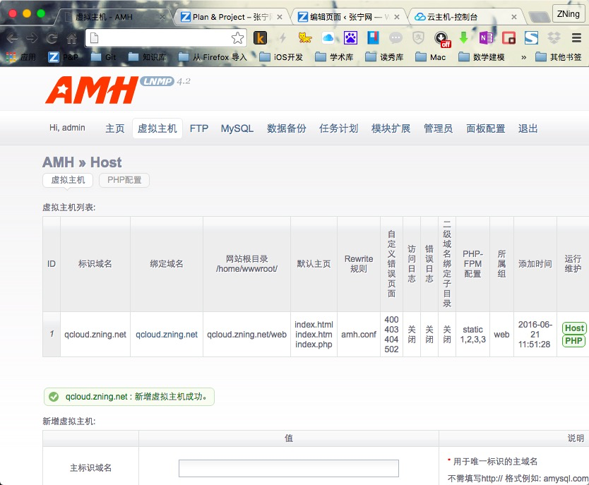

其他的不用动，直接点保存即可。

**配置数据库**

单击`MySQL`下的`快速建库`，在`数据库名称`、`用户名`、`用名密码`处输入相关信息，并记录下来。单击创建即可。如图所示。

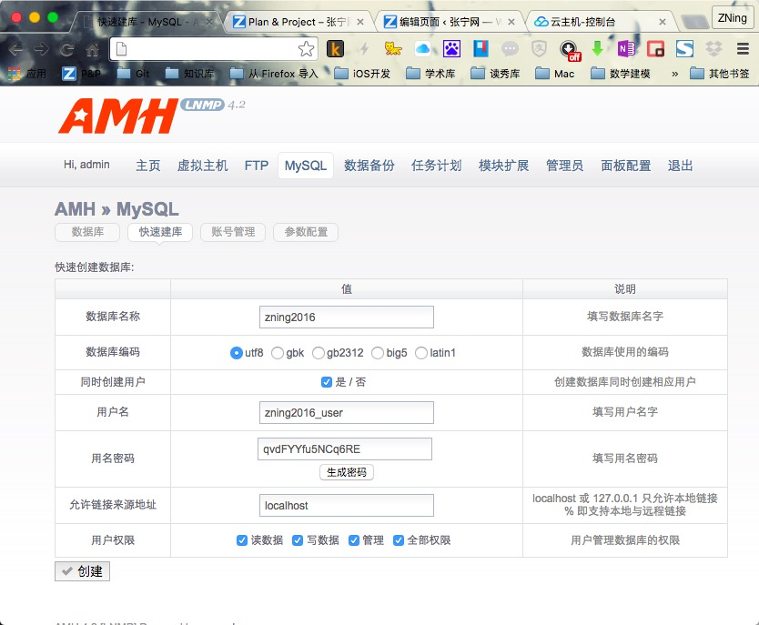

**安装WordPress**

紧接着，我们回到命令行终端界面（terminal），首先进入网站文件夹：

	# cd /home/wwwroot/qcloud.zning.net/web
	
备份已存在文件：

	# mv index.html index.html.bak
	
下载WordPress：

	# wget https://cn.wordpress.org/wordpress-4.5.2-zh_CN.tar.gz
	
解压文件

	# tar zxvf wordpress-4.5.2-zh_CN.tar.gz

移动文件

	# mv /home/wwwroot/qcloud.zning.net/web/wordpress/* /home/wwwroot/qcloud.zning.net/web
	
访问域名，进行最后一步的安装。

> 安装情况同上节相关子节，请参见上一节的相关子节
	
	

### 在服务器上安装WDCP并完成网站创建

wdCP是WDlinux Control Panel的简称，是一套通过WEB控制和管理服务器的Linux服务器管理系统以及虚拟主机管理系统，旨在易于使用Linux系统做为我们的网站服务器系统，以及平时对Linux服务器的常用管理操作，均可在wdCP的后台里操作完成.

关于WDCP的安装，这里不多介绍了，与AMH相似，而且功能跟更强大。相关[WDCP安装教程请单击此处获取](http://www.wdlinux.cn/wdcp/)，网站上也有不少教程。

> wdCP v3版本已经发布，更多可[单击此处查看](http://www.wdlinux.cn/bbs/forum-23-1.html)


## 【懒人安装V2.0——腾讯云镜像安装】

### 又是前奏：环境检查

1. 操作系统：CentOS 6.5 x64（腾讯云镜像版本）
2. 服务架构：LAMP
3. 软体版本：腾讯云WordPress镜像

###安装步骤

这个比刚才那个还简单，整个一个傻瓜操作。

1. 登陆腾讯云管理中心，根据你所买的服务器的地域，找到你的 CVM，点击重装系统。（注意：如服务器正在运行，则需要停止服务器才可以重装系统）

2. 重装系统时选择 `服务市场-->建站模板-->WordPress 博客平台(Centos 6.5 64 位)(8GB)`，之后输入root密码，点击重置即可。

	

3. 通过ssh进行连接（Linux：terminal终端；Mac：终端或iTerm；Windows：Xshell或putty）服务器，格式如下：

		ssh 用户名@IP地址 e.g. ssh root@127.0.0.1

	进入后，通过命令`cat default.pass`查看MySQL、WordPress等相关帐密。
	
	


4. 按照提示，进入服务器IP，登陆相关账户可以进行设置. PHPmyAdmin 的地址为 http://ip/phpmyadmin

	

###小结

这个方法比较简单，就不过多介绍了。

## 【文艺安装——Docker安装】

### 永恒不变的前奏：环境检查

1. 操作系统：Linux（本例使用的大部分在CentOS 7.x x64与Ubuntu 14.04.1 LTS 64位上可行）
2. 服务架构：Docker
3. 软体版本：Docker 1.9.1

> Tips:Docker 目前只能安装在 64 位平台上，并且要求内核版本不低于 3.10，实际上内核越新越好，过低的内核版本容易造成功能的不稳定。

### 第一节：安装Docker（演示的是CentOS 7.0 x64版本）

> 本节节选自《Docker——从入门到实践》，图书在GitBook公开阅读且接受commit。向开源作者致敬！

这里1与2根据系统不同选择阅读即可，如果非深入学习不必全部阅读。

#### 1. CentOS安装Docker

系统的要求是：64 位操作系统，内核版本至少为 3.10。

Docker 目前支持 CentOS 6.5 及以后的版本，推荐使用 CentOS 7 系统。

**安装yum软件源**

首先，添加 yum 软件源。

	$ sudo tee /etc/yum.repos.d/docker.repo <<-'EOF'
	[dockerrepo]
	name=Docker Repository
	baseurl=https://yum.dockerproject.org/repo/main/centos/$releasever/
	enabled=1
	gpgcheck=1
	gpgkey=https://yum.dockerproject.org/gpg
	EOF

**安装 docker-engine（Docker）**

之后更新 yum 软件源缓存，并安装 docker-engine。

	$ sudo yum update
	$ sudo yum install -y docker-engine

对于 CentOS 7 系统，CentOS-Extras 源中已内置 Docker，如果已经配置了CentOS-Extras 源，可以直接通过上面的 yum 命令进行安装。

另外，也可以使用官方提供的脚本来安装 Docker。

	$ sudo curl -sSL https://get.docker.com/ | sh

**后续配置**

可以配置让 Docker 服务在系统启动后自动启动。

	$ sudo chkconfig docker on
	
配置完成后截图：（获取Docker版本）

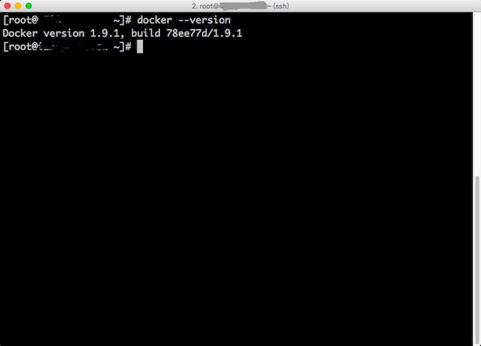

#### 2. Ubuntu安装Docker

**更新APT镜像源**

首先需要安装 apt-transport-https 包支持 https 协议的源。

	$ sudo apt-get install apt-transport-https ca-certificates
	
添加源的 gpg 密钥。

	$ sudo apt-key adv --keyserver hkp://p80.pool.sks-keyservers.net:80 --recv-keys 58118E89F3A912897C070ADBF76221572C52609D
	
获取当前操作系统的代号。

	$ lsb_release -c
	Codename:       trusty

一般的，12.04 (LTS) 代号为 precise，14.04 (LTS) 代号为 trusty，15.04 代号为 vivid，15.10 代号为 wily，16.04 代号为Xenial 。这里获取到代号为 trusty。
接下来就可以添加 Docker 的官方 apt 软件源了。通过下面命令创建 `/etc/apt/sources.list.d/docker.list` 文件，并写入源的地址内容。非 trusty 版本的系统注意修改为自己对应的代号。

	$ sudo cat <<EOF > /etc/apt/sources.list.d/docker.list
	deb https://apt.dockerproject.org/repo ubuntu-trusty main
	EOF
	
添加成功后，更新 apt 软件包缓存。

	$ sudo apt-get update
	
**分版本的预安装任务**

这里演示高于 12.04 LTS的版本

* Ubuntu Xenial 16.04 (LTS)
* Ubuntu Wily 15.10
* Ubuntu Trusty 14.04 (LTS)

为了让 Docker 使用 aufs 存储，推荐安装 linux-image-extra 软件包。 

	$ sudo apt-get install -y linux-image-extra-$(uname -r)

在 Ubuntu 14.04 或者 12.04上安装Docker，需要安装apparmor（apparmor是Linux内核的一个安全模块，新版本的Ubuntu已经被整合到内核）:

	$ sudo apt-get install apparmor
	
**安装 Docker**

在成功添加源之后，就可以安装最新版本的 Docker 了，软件包名称为 docker-engine。

	$ sudo apt-get install -y docker-engine
	
如果系统中存在旧版本的 Docker （lxc-docker），会提示是否先删除，选择是即可。


### 第二节：安装基础环境及WordPress

**抓取mysql镜像**（灵雀云镜像，下同）：

	docker pull index.alauda.cn/alauda/mysql


**抓取WordPress镜像**

	docker pull index.alauda.cn/library/wordpress
	
**建立mysql容器**

	docker run --name zning-docker-test-blog-db -e MYSQL_ROOT_PASSWORD=hellozningdocker -d index.alauda.cn/alauda/mysql
	
其中，`zning-docker-test-blog-db`是MySQL数据库名，`hellozningdocker`为这个数据库的密码。
	
**建立WordPress容器并运行**

	docker run --name zning-docker-test-blog --link zning-docker-test-blog-db:mysql -p 80:80 -d index.alauda.cn/library/wordpress
	
其中，`zning-docker-test-blog`为镜像名，`zning-docker-test-blog-db:mysql`为你所起的数据库名与数据库类型，`80：80`为Docker 容器端口与宿主机端口映射设置。

启动后，我们可以通过`docker ps`命令查看现在系统中运行着的容器

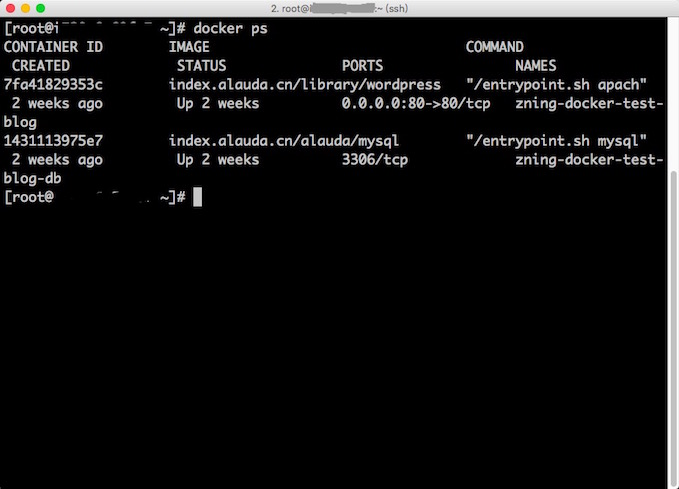

我们可以看到，现在数据库与WordPress的容器都运行起来了，现在就可以通过IP地址访问了~（为保护隐私，接图已隐去IP地址）

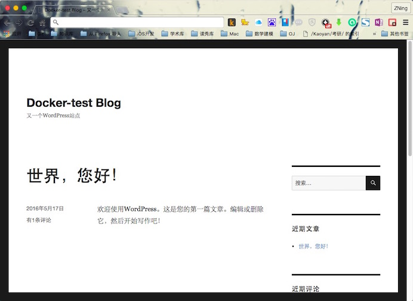

### 小结

Docker其实看起来命令比较多，其实都不复杂。简单的几行命令就完成了。而且Docker更多的还在虚拟化技术，这都需要我们一起去探索哦~

## 参考资料

1. [CentOS 7 / RHEL 7 上安装 LAMP + phpMyAdmin - 水景一页](https://cnzhx.net/blog/centos-rhel-install-lamp-phpmyadmin/#sysenv)
2. 白宦成. 使用腾讯云市场 WordPress 镜像部署博客[J/OL]. 黄冈师范学院, 2016-06-03.
2. [Docker —— 从入门到实践 - GitBook](https://www.gitbook.com/book/yeasy/docker_practice/details)
3. 曾金龙，肖新华，刘清编著.Docker开发实践[M].北京：人民邮电出版社.2015.

> ***下篇预告：腾讯云搭建Git服务（命令行/开源Web）***

